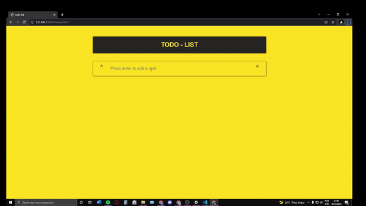

# TODO LIST

```
O usuário pode anotar sua tarefa e ao apertar enter ela entrará na lista, também é possível
riscar a tarefa apertando no checkbox, ou também retirá-la apertando no X.

```

<p align="center">
  
</p>

# OBSERVAÇÕES

- O projeto me deu uma noção mais robusta de Javascript, me ensinando funcionalidades 
  que podem ser usadas em outros contextos.
- Os dados foram armazenados no Local Storage do browser.
